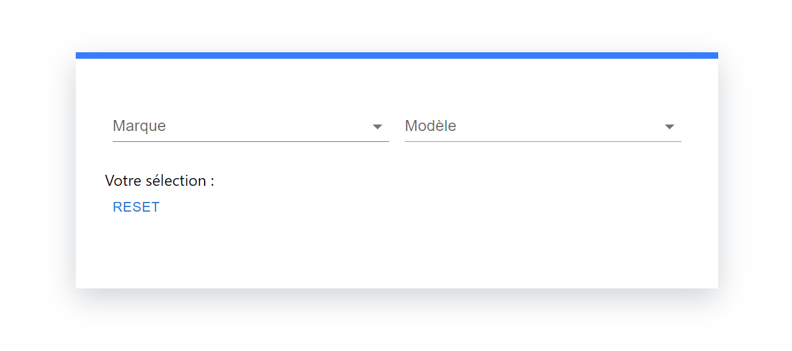
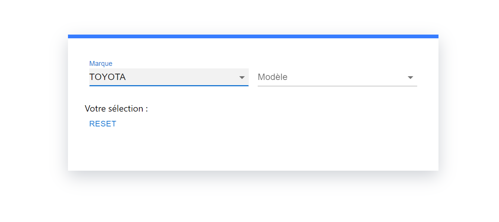
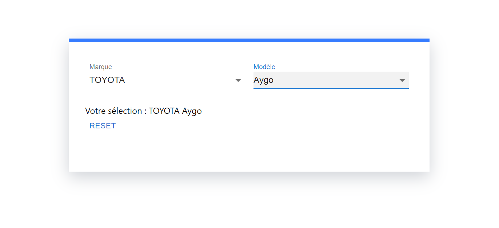

# evalucar_select
Application ReactJS qui implémente deux listes déroulantes avec des comportements spécifiques.

<ul>
  <li>Clonez le repository</li>
  <li>Executez la commande : npm install</li>
  <li>Lancer le programme : npm start</li>
  <li>Deployer avec : npm run build (il faut d'abord modifier le .env avant de builder pour parametrerle serveur)</li>
</ul>

